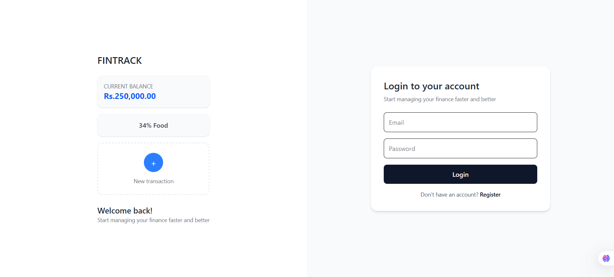
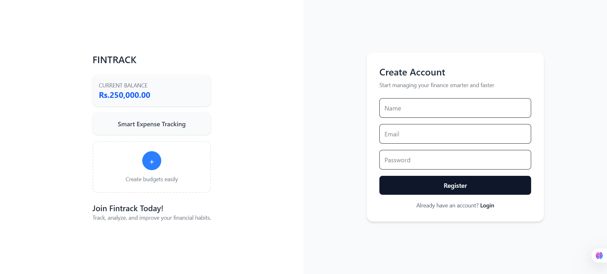
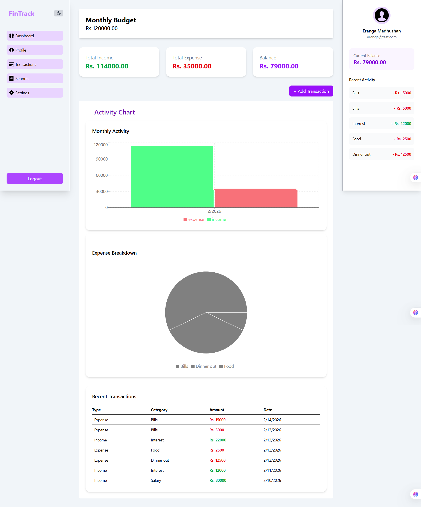

# 🚀 FinTrack — Personal Finance Dashboard
## 📌 Overview

FinTrack is a full-stack MERN-based Personal Finance Management dashboard built with a SaaS-style architecture. It allows users to track income, expenses, analyze financial data through visual reports, and manage personal budgets.

## Screen Captures
### Login


### Register


### Dashboard


## 🛠️ Tech Stack

## Frontend

- React + Vite
- TypeScript
- Tailwind CSS v4
- Recharts
- React Hook Form

## Backend

- Node.js
- Express
- MongoDB
- Mongoose
- JWT Authentication
- MongoDB Aggregation Pipelines

## 🔐 Features

- Secure JWT Authentication
- Profile Management (currency, monthly budget, - password update)
- Transaction CRUD operations
- Monthly income vs expense analytics (Bar chart)
- Category-based expense breakdown (Pie chart)
- Dynamic recent activity panel
- Budget display integration
- Persistent Dark Mode
- Responsive SaaS-style UI layout

## 📊 Advanced Backend Logic

- MongoDB Aggregation for:
- Monthly financial summary
- Category breakdown
- Secure protected routes middleware
- Structured modular architecture

## ⚙️ Installation

```bash
# Clone repository
git clone https://github.com/Erangamadhushan/Expenses-Tracker.git

# Backend
cd server
npm install
npm run dev

# Frontend
cd client
npm install
npm run dev

```

## 🌍 Deployment

- Frontend → Vercel
- Backend → Render
- MongoDB → MongoDB Atlas

## 👨‍💻 Author

### Eranga Madhushan
Full Stack Developer | MERN | Spring Boot | Next.js | FinTech Enthusiast | Aspiring Platform Engineer